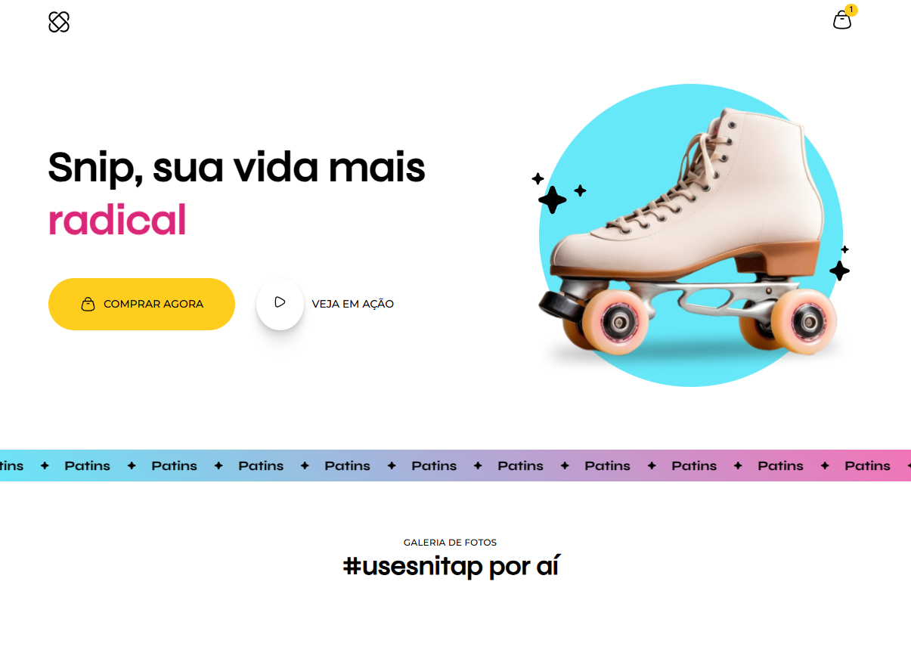

<h1 align="center" style="font-weight: bold;">CSS Animation (rocketseat) 💻</h1>

    <b>Layout created based on the lessons learned from the CSS Animation classes of the Full Stack course at Rocketseat.</b>

     <a href="https://jbrunops.github.io/rocketseat-cssanimation-site1/">📱 Visit this Project</a>

<h2 id="layout">🎨 Layout</h2>

    

<h2 id="technologies">💻 Technologies</h2>

- HTML
- CSS (Grid, flexbox, css animation)

<h2 id="layout">👍 What i learned</h2>
<b>
In this project, I developed a website using various front-end technologies and techniques. Here are the key learnings:

- HTML: Structured the page content using HTML5, ensuring proper semantics and accessibility.

- CSS: Styled the page with CSS3, applying animations, CSS variables, and complex layouts using Flexbox and Grid.

- Sass/Less: Utilized a CSS preprocessor to facilitate maintenance and organization of the code, taking advantage of features like selector nesting and variables.

- Google Fonts: Implemented custom fonts using Google's font service to enhance the site's typography.

- CSS Animations: Created smooth and interactive animations for page elements, such as the photo gallery and header, providing a visually appealing experience.

One of the most interesting parts of this project was creating an interactive photo gallery that uses CSS Grid for a responsive layout and CSS animations for smooth transitions. This project allowed me to deepen my front-end knowledge and improve my skills in creating dynamic and responsive interfaces.
</b>
